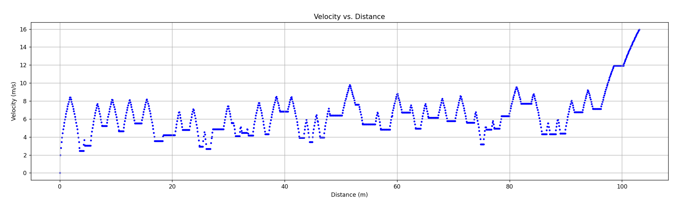
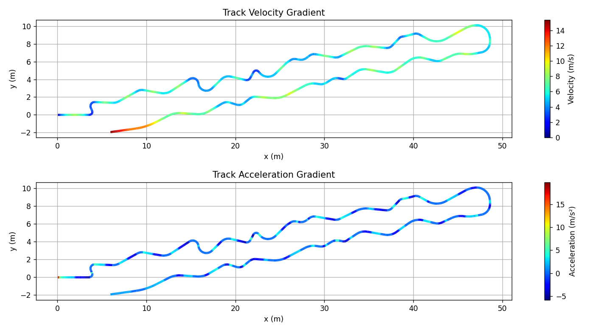

# 🏁 OTR Lap 

A simple steady-state lap time simulation and track visualization tool developed for the Ontario Tech Racing Team.  
Estimates lap times on custom tracks using steady-state assumptions and visualizes velocity and acceleration gradients along the track.
This simulator is designed specifically for EV's.

 

## 🏎️ Project Overview 

This project currently consists of 3 Python scripts:

1. **Lap Time Simulator (`LTSAlgorithm.py`)**  
   - Reads track segment data from CSV files (segment length and radius).  
   - Calculates velocity profiles around the track based on a fixed lateral acceleration limit (gg-circle radius).  
   - Outputs lap time and velocity profile.  
   - Saves velocity data to `track velocities.csv`.  
   - Plots velocity vs distance graph.

2. **Gradient Maps Visualization (`GradientMaps.py`)**  
   - Reconstructs the 2D layout of the track from the CSV track data.  
   - Loads velocity data from `track velocities.csv` generated by the simulator.  
   - Calculates acceleration profile along the track.  
   - Visualizes velocity and acceleration as color gradients on the track map.

3. **Vehicle Modelling and GGV Generation (`Vehicle.py`)**
   - Reads in parameters from a vehicle in the `Vehicle` directory.
   - Calculates external forces acting on vehicle
   - Calculates traction limits from tires
   - Generates a GGV plot.

 

## ⚠️ Status 

This project is currently a **WORK IN PROGRESS**.

Planned features include:
- Adding a vehicle model to generate a ggv plot and replace the current circular gg assumption used in the lap time simulation algorithm.
- Developing an user interface to simplify track input and simulation control for easier use.
- Saving of computed vehicle data to allow for faster runtime.
- Load transfers and battery discharge.

 

## 🛠️ Requirements 

- Python 3.8 or newer
- Packages:
  - `numpy`
  - `matplotlib`
 
 

## ▶️ Running the Simulation 

Run the _LTSAlgorithm.py_ script that starts the lap time simulation and generates the plots.

### 📊 Plot Examples :

